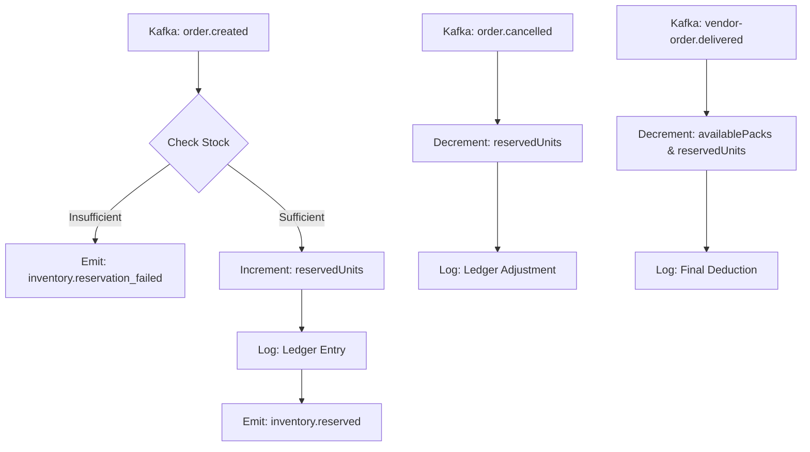

# 🛡️ MediGo Inventory Microservice

[](https://microservices.io/)
[](https://www.mongodb.com/)
[](https://kafka.apache.org/)

The **Inventory Microservice** is the guardian of stock integrity in the MediGo ecosystem. It handles multi-shop inventory management, real-time stock reservations, and a persistent audit trail via a cryptographic-style **Stock Ledger**.

---

## 🏗️ Stock Lifecycle & Saga Role

In our distributed ecosystem, the Inventory service acts as a **Participant** in the Order Saga. It follows a "Reserve-First, Deduct-Later" logic to prevent race conditions.



---

## 🚀 Service Features

### Atomic Stock Reservations
- **Zero Overselling**: Stock is "soft-locked" via `reservedUnits` immediately after an order is placed, making it unavailable for others even before payment is complete.
- **Auto-Correction**: Listens for cancellation events to release reserved stock back into the "available" pool automatically.

### Verifiable Stock Ledger
- **Immutable Audit Trail**: Every single unit movement (Inward, Reserve, Release, Deduct) is logged with an `orderId` or `userId` reference.
- **Consistency Checks**: Provides a source of truth for reconciling physical warehouse data with digital sales.

---

## 📡 API Reference

### Shop Owner API (`/api/inventory`)
| Method | Endpoint | Description | Auth |
|:---:|:---|:---|:---:|
| `POST` | `/` | Onboard new medical items to shop | Owner |
| `PATCH` | `/:id/stock` | Manual inward/adjustments | Owner |
| `GET` | `/shop/:shopId` | Real-time dashboard view | Owner |
| `GET` | `/shop/:shopId/alerts` | Low stock/Expiry reports | Owner |

### Internal Fulfillment API (`/api/internal/inventory`)
| Method | Endpoint | Description |
|:---:|:---|:---|
| `POST` | `/get-prices` | Bulk price validation for Order Service |
| `GET` | `/items` | Map Product IDs to Shop Inventory |

---

## ✉️ Event Dictionary

### Consumed Topics
- **`order-events`**: Consumes `order.created` (triggers reservation) and `order.cancelled` (triggers release).

### Produced Topics
- **`inventory-events`**: Emits `inventory.reserved` or `inventory.reservation_failed`.

---

## 🛠️ Infrastructure Setup

### Environmental Variables
```env
PORT=3008
MONGODB_URI=mongodb://localhost:27017/inventory-service

# Kafka Cluster
KAFKA_BROKERS=localhost:9092
KAFKA_ORDER_TOPIC=order-events
KAFKA_INVENTORY_TOPIC=inventory-events
KAFKA_CONSUMER_GROUP=inventory-service-fulfillment
```

### Installation
1. `npm install`
2. `npm run dev`

---

## ⚖️ License
Internal MediGo Distributed Logic - (c) 2026 Core Engineering Team.
